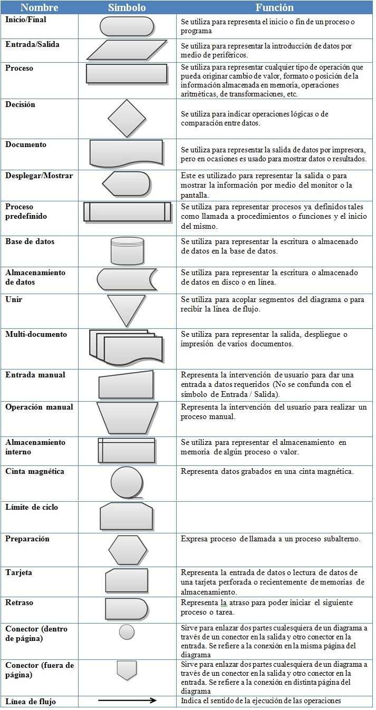

# Algoritmo
## Solución de una necesidad con pasos lógicos y finitos

* Cualitativo: Solución subjetiva
* Cuantitativo: Solución exacta

1. Pseudocódigo:
    * No es un lenguaje de programación
    * Expresa de menera cronológica la solución de un requerimiento
    * Maneja una sintaxis de fácil lectura

#### Nota: Un lenguaje de programación puede realizar operaciones ariméticas, relacionales y lógicas. Casi el 100% de los lenguajes estan en idioma inglés. Tambíen tiene otras acciones muy propias de los lenguajes, como sintaxis, conpilación, entre otras. 

#### Para definri variables se recomienda    
```
    camelCase = nombreEstudiante
    PascalCase => NombreEstudiante
    unders_core => nombre_estudiante
    kebab-case => nombre-estudiante
```

## Palabras reservadas para crear Pseudocódigo

- `INICIO` * `FIN` 
- `DEFINIR` * `COMO`
- `ESCRIBA`
- `LEA` 
- `SI` * `ENTONCES` * `SINO` * `FIN SI`
- `PARA` * `FIN PARA`
- `HASTA` * `FIN HASTA`
- `MIENTRAS` * `FIN MIENTRAS`
- `HAGA`
- `CASO` * `DE` * `OTRO` * `FIN CASO`
- `FUNCION` * `RETORNE` * `FIN FUNCION`
- `PROCEDIMIENTO` * `FIN PROCEDIMIENTO`
- `REPETIR` * `HASTA_QUE`
- `SELECCIONAR` * `FIN SELECCIONAR`
- `ROMPER`
- `CONTINUAR`
- `ENCADENAR`
- `LARGO`
- `ANCHO`
- `CARACTER` * `ENTERO` * `REAL` * `BOOLEANO` * `CADENA` * `ARREGLO`
- `REGISTRO`
- `ARCHIVO`
- `LEER_ARCHIVO`
- `ESCRIBIR_ARCHIVO`
- `ABRIR_ARCHIVO`
- `CERRAR_ARCHIVO`

#### Nota: Una buena manera de diferenciar estas palabras, es escribirlas en mayúscula. 

## Ejemplo

#### Ej1 Obtener el promedio de tres notas y luego mostrar el resultados. 

```
    INICIO
        DECLARAR nota1, nota2, nota3, promedio, sumatoria COMO REAL
        
        nota1 <- 3.4
        nota2 <- 5.0
        nota3 <- 2.8
        
        sumatoria <- nota1+nota2+nota3
        promedio <- sumatoria/3
        
        ESCRIBA "El promedio del estudiante es de: ",promedio
    FIN
```

#### Ej2 En la tienda de Pepito, se vende el kilo de naranjas a $380, se desea saber cuanto debe pagar un cliente por n kilos, dónde n corresponde a la cantidad de kilos que lleva el usurio.

```
    INICIO
        DEFINIR cantidad COMO ENTERO
        DEFINIR totalPagar COMO REAL
        
        ESCRIBA "Digite la cantidad de kilos a llevar: "
        LEA cantidad
        
        totalPagar <- cantidad * 380
        
        ESCRIBA "El valor a pagar es de ",totalPagar
    FIN
```


2. Diagrama de flujo:
	
    * Responde a la misma necesidad de un Pseudocódigo, solo es este es representado de manera gráfica. 



## Ejemplo

#### Ej1 Obtener el promedio de tres notas y luego mostrar el resultados. 

